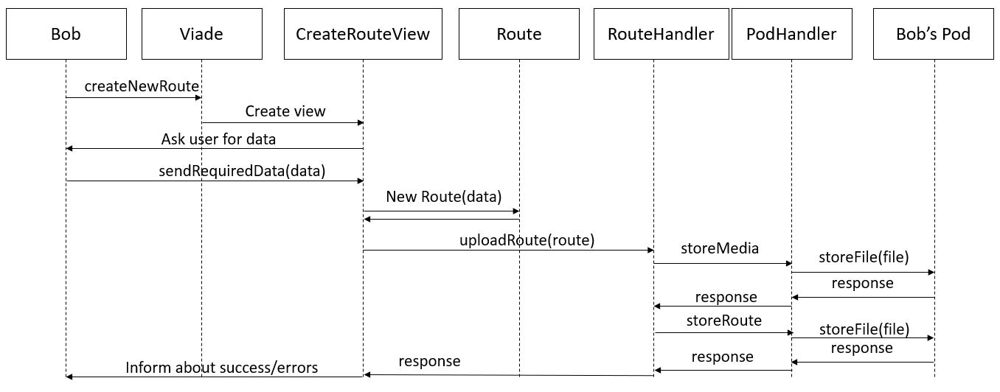

[[section-building-block-view]]

== Building Block View

=== Level 1

In this first level we take a look on viade's parts.

.Components
These are react components, they show the interface and interact with the user. The components not only encapsulates parts of the interface, but also funcionalities.

.Handlers
They manage the interaction with the pod and translates the data.

.Cache
Since solid slows down when it needs to retrieve a lot of data we decided to implement a small cache that temporaly stores the routes whithin the session.

.Entities
Even though they are not reprresented in the diagram, they are clases that represent data. These makes that makes the file format of the routes independent from the rest of the aplication. The interface components and the cache deals with the Route entity and others, instead of dealing with the files directly.

=== Level 2

Thie second block is a closer look into the handlers.

.RouteHandler
It coordinates the interaction between the information retrieved from the pod and its tranlation into entities.

.PodHandler
It deals with getting and uploading files into the pod.

.Parsers
They translate the files from the pod.

=== Overview
These would be and example of the diferent parts interacting when uploading a route.

